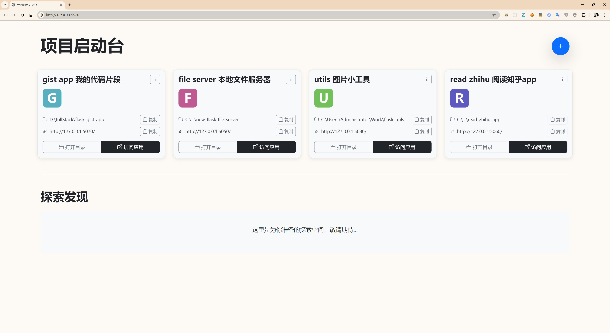

# Flask 个人项目管理面板

为了管理你的锤子，你又去造了一个锤子架子

管理端口。

## 起因，目的

我有很多的自己的app，

flask 有几个，react js 有几个
占用了很多端口，有点乱， 自己容易搞忘记哪个是哪个，如何组织管理？
打算再写个 app 来管理，目的是一眼看出来，有哪些端口。




## 主要功能

- **项目仪表盘**: 以卡片形式清晰地展示所有项目。
- **快速操作**: 方便地添加、编辑和删除项目。
- **一键直达**: 快速打开项目的 URL 或其本地文件夹。
- **轻量化**: 所有数据存储在 `projects.json` 文件中，无需数据库。

## 如何运行

1.  **安装依赖**:
    ```bash
    # 建议先创建并激活 Python 虚拟环境
    pip install -r req.txt
    ```

2.  **启动应用**:
    ```bash
    python app.py
    ```

3.  **访问**:
    在浏览器中打开 `http://127.0.0.1:9926`。

## 设置开机自启动 (Windows)

1.  确保 `run_flask_port.bat` 中的项目路径正确。
2.  将 `run_flask_port.bat` 的**快捷方式**放入系统的“启动”文件夹 (`shell:startup`)。